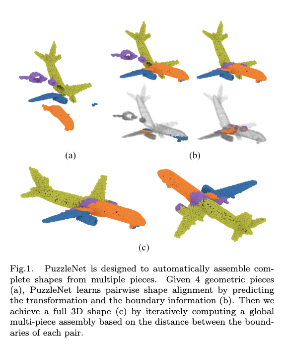
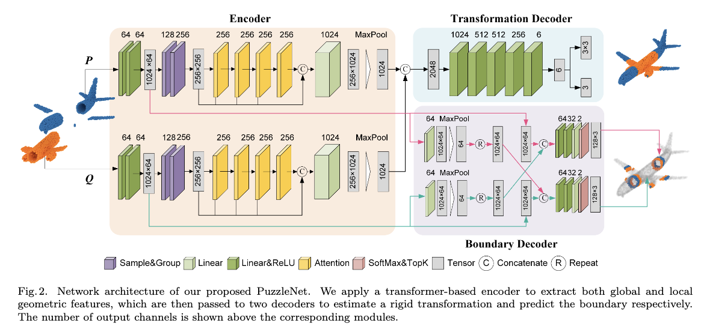

# PuzzleNet: Boundary-Aware Feature Matching for Non-overlapping 3D Point Clouds Assembly

This is a pytorch implementation of PuzzleNet: Boundary-Aware Feature Matching for Non-overlapping 3D Point Clouds Assembly.

## News

2022.12.20: This paper is received by Computational Visual Media Conference(CVM2023).

## Astract



We address the 3D shape assembly of multiple geometric pieces without overlaps, a scenario often encountered in 3D shape design, field archeology, and robotics. Existing methods depend on strong assumptions on the number of shape pieces and coherent geometry or semantics of shape pieces. Despite raising attention on 3D registration with complex or low overlapping patterns, few methods consider shape assembly with rare overlaps. To address this problem, we present a novel framework inspired by solving puzzles, named PuzzleNet, which conducts multi-task learning by leveraging both 3D alignment and boundary information. Specifically, we design an end-to-end neural network based on a point cloud transformer with two-way branches for estimating rigid transformation and predicting boundaries simultaneously. The framework is then naturally extended to reassemble multiple pieces into a full shape by using an iterative greedy approach based on the distance between each pair of candidate-matched pieces. We train and evaluate PuzzleNet on both real-world urban scan data (DublinCity) and synthetic CAD models (ModelNet40). Experiments demonstrate our effectiveness in solving 3D shape assembly for multiple pieces with arbitrary geometry and inconsistent semantics. We significantly outperform state-of-the-art 3D registration approaches as well as the closely related method for shape mating.

## Architecture



## Requirements

```
helper==2.5.0
hydra-core==1.3.1
matplotlib==3.5.1
numpy==1.21.5
omegaconf==2.3.0
open3d==0.15.2
plyfile==0.7.4
pytorch_lightning==1.6.2
scipy==1.8.0
setuptools==59.5.0
torch==1.10.1
torchvision==0.11.2
tqdm==4.64.0
```

## Dataset Processing Steps

The dataset are packed as `npy` files in `./data/` folder. The files are pre-processed and used as training or testing dataset for different categories.  We provide three categories as default, which are `vase, airplane, bed` from dataset `ModelNet40`. And the geometric dataset is modified from `DublinCity`. 

The steps for processing your own dataset is as followed:

1. Download dataset from ModelNet40 or others. In our work, we take ModelNet40 as an example.
2. Convert the `.off` files into point clouds `.ply`  files first by open-source software `CloudCompare`. We strongly recommand to use the command-line interface to do this with a script. The number of sampled points from each mesh is  about 12000.
3. Normalization the points into an unit sphere of $[0,1]^3$.
4. Split the dataset into traing set and testing set.
5. Add or modify the corresponding code in `dataset.py`.

## Usage

**training**

```shell
python train.py --batch_size 64 --lr 0.9e-3 --loss_mode 1 --dataset bed_sphere --pretrain_epochs 0 --device $cuda_number$
```

**testing**

```shell
python test.py
```

The `test.py` script will automaticly use the same cuda device as the training step.
